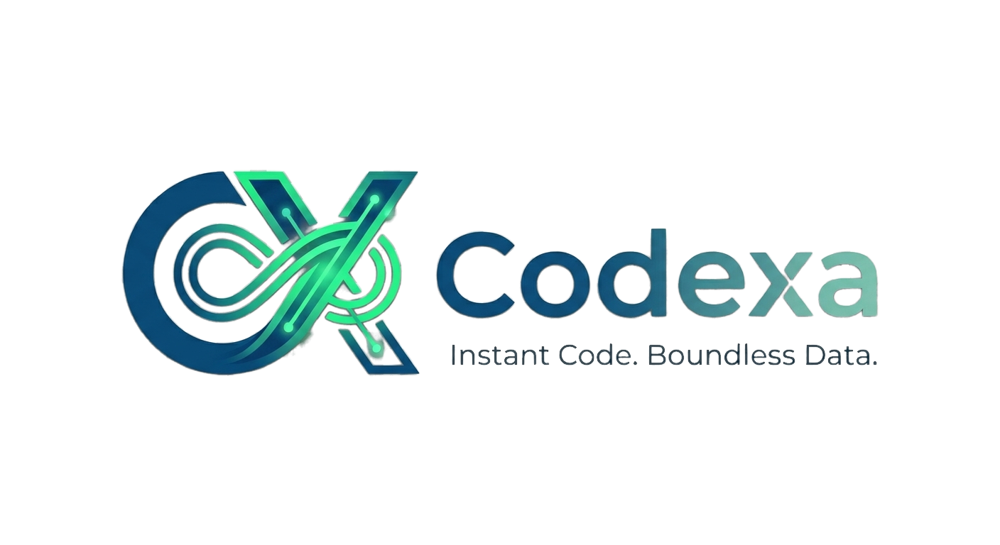

<div align="center">



# Codexa

### Real-Time Collaborative Code Editor & 1v1 Competitive Programming Arena

A modern browser-based IDE bridging seamless multiplayer collaboration, ranked 1v1 coding duels, and an AI-powered pair programmer.

[](https://react.dev/)
[](https://vitejs.dev/)
[](https://microsoft.github.io/monaco-editor/)
[](https://socket.io/)
[](LICENSE)

<br />

[📖 Why Codexa?](#-why-i-built-codexa) • [✨ Features](#-core-features) • [🏛️ Architecture](#-project-structure) • [🚀 Getting Started](#-getting-started) • [👨‍💻 Author](#-author--contact)

</div>

---

## 💡 Why I Built Codexa

As a software engineer who regularly participates in competitive programming and conducts pair-programming sessions, I noticed three recurring pain points:

1. **Disconnected Collaboration**: Screen-sharing over Discord or Google Meet is passive and laggy. Only one person codes while others watch, killing engagement.
2. **Environment Setup Friction**: Testing multi-language solutions or interviewing candidates often requires complex local setups or juggling multiple web tabs (editor, judge, scratchpad).
3. **Competitive Algorithmic Practice is Isolated**: Practicing problems on LeetCode or Codeforces is solitary. There is no lightweight way to challenge a peer to an instant, head-to-head live duel with automated scoring.

**Codexa** was engineered to solve these problems in a single browser tab:
- Open a shared room, invite peers, and code together with VS Code-grade IntelliSense.
- Jump into the **1v1 Battle Arena** to solve algorithmic challenges against a rival under a live countdown.
- Get instant, unblocking code feedback via a **streaming AI assistant** (Gemini 2.0 & DeepSeek) when edge cases fail.

---

## ✨ Core Features

### 1. 👥 Real-Time Multiplayer Collaborative IDE
- **Monaco Editor Engine**: Built on the same core as Visual Studio Code, offering syntax highlighting, auto-completion, minimap, bracket matching, and theme customization.
- **Bi-Directional State Synchronization**: Powered by Socket.IO with a client-side **300ms debounce** engine to optimize socket traffic and an internal `isRemoteChange` flag to eliminate infinite echo loops.
- **Live User Presence**: Displays active participant avatars, online status, and synchronized cursor positions with color-coded identifiers.
- **Version History (Snapshot Time Machine)**: Automatically maintains a rolling history of up to 20 code snapshots per room, allowing instant rollback without Git overhead.
- **Integrated Live Chat**: Discuss architecture and paste code snippets directly alongside the editor buffer.

### 2. ⚔️ 1v1 Battle Arena (Competitive Coding Duels)
- **Ranked Matchmaking**: Join an in-memory queue to match against developers of comparable skill level via dedicated Socket namespace (`/battle`).
- **Direct Username Challenge**: Send a direct invite to any registered developer for an instant private match.
- **The 30-Minute Showdown**: Compete under a live countdown timer with a split-screen view showing the problem statement, code editor, and live opponent progress.
- **Instant Automated Judge**: Real-time evaluation of submissions against public and hidden test cases, automatically awarding points and updating win/loss records.

### 3. 🤖 Streaming AI Pair Programmer (Dual Engine)
- **Token-by-Token Streaming**: Responses stream directly into the UI using **Server-Sent Events (SSE)** for an immediate typing experience.
- **Four Focused Dev Modes**:
  - **Explain**: Analyzes algorithmic time complexity $\mathcal{O}(N)$ and breaks down non-trivial logic.
  - **Fix Bug**: Takes compilation errors or runtime stack traces and suggests a clean code fix.
  - **Optimize**: Recommends cleaner patterns and reduces space/time bottlenecks.
  - **Codebase Chat**: Context-aware Q&A with visibility into the active code buffer.
- **Multi-Model Resilience**: Supports Google Gemini 2.0 Flash and DeepSeek gateways with automatic round-robin key rotation to prevent quota exhaustion.

### 4. 📋 Online Judge & Autonomous Hidden Testcase Engine
- **Codeforces Catalog**: Fetches real contest tasks with formatted problem statements and mathematical formulas rendered via MathJax.
- **AI-Generated Hidden Edge Cases**: When a problem lacks hidden tests, AI analyzes the problem specifications to craft edge cases (overflow bounds, boundary limits, empty inputs) scaled by difficulty (**Easy: 3 tests, Medium: 5 tests, Hard: 8 tests**).
- **Multi-Language Sandbox**: Run and verify solutions across **7 languages**: C++ (GCC 13.2), Python 3.12, Java 22, JavaScript (Node 20), TypeScript, C# (.NET Core), and PHP 8.3.

### 5. 🏆 Gamification & Activity Heatmap
- **7 Competitive Tiers**: Iron $\rightarrow$ Bronze $\rightarrow$ Silver $\rightarrow$ Gold $\rightarrow$ Platinum $\rightarrow$ Diamond $\rightarrow$ Master.
- **Anti-Farming Point System**: Points are awarded only on the first Accepted (`AC`) submission per problem.
- **Daily Challenge & Streaks**: Auto-selected daily problems with streak tracking to encourage consistent practice.
- **Activity Heatmap**: A GitHub-inspired calendar heatmap displaying annual problem-solving consistency.
- **Unlockable Achievements**: Earn badges for speed, streak milestones, and first-attempt solves.

---

## 🏛️ Project Structure

This repository contains the standalone **Codexa Frontend Application**:

```
Codexa/
├── public/                     # Static assets, logos & rank icons
│   ├── anhRank/                # 3D Cyberpunk rank tier badges
│   ├── codexa-logo.png         # Brand logo
│   └── codexa-logo-transparent.png
├── src/
│   ├── component/              # Modular UI components
│   │   ├── Battle/             # BattleHub, BattleQueue, BattleRoom (1v1 Arena)
│   │   ├── Editor/             # Monaco Editor wrapper & execution panels
│   │   ├── AIPanel/            # AI Assistant sidebar with SSE streaming
│   │   ├── Problems/           # Problemset browser & ProblemPage runner
│   │   ├── Profile/            # User profile, rank badges & Activity Heatmap
│   │   ├── Admin/              # Admin dashboard & problem scraper controls
│   │   ├── RoomMenu/           # Room creator & directory
│   │   ├── Login/              # Auth forms (login, register)
│   │   └── AuthPages.jsx       # Email verification & password recovery
│   ├── hooks/                  # Custom hooks (useSocket, useAuth)
│   ├── contexts/               # React Contexts (SettingsContext, ThemeContext)
│   ├── landing/                # Product landing page
│   ├── monaco/                 # Monaco themes, language definitions & shortcuts
│   ├── services/               # REST API clients & authentication helpers
│   ├── App.jsx                 # Routing table (React Router v7)
│   ├── CodeApp.jsx             # Core real-time collaborative workspace
│   └── main.jsx                # Application bootstrap
├── .env.example                # Template for environment variables
├── index.html                  # HTML entry with MathJax & Google Fonts
├── package.json                # React 19, Vite 8, Monaco Editor dependencies
├── vite.config.js              # Vite build configuration
└── LICENSE                     # MIT License
```

---

## 🛠️ Technology Stack

| Layer | Technology | Purpose |
|---|---|---|
| **Core Framework** | **React 19.2.4** | Modern component-based user interface |
| **Bundler & Tooling** | **Vite 8.0.1** | Sub-second Hot Module Replacement (HMR) and production builds |
| **Code Editor** | **Monaco Editor** (`0.55.1`) | Desktop-class code editing engine (VS Code core) |
| **Styling** | **Bootstrap 5.3** + **Sass (SCSS)** | Clean dark-mode interface with modular styling |
| **Routing** | **React Router v7.14** | Client-side Single Page Application (SPA) routing |
| **Real-time Protocol** | **Socket.IO Client 4.8.3** | Bi-directional WebSocket events for code sync & battle queues |
| **Math Rendering** | **MathJax 3** | LaTeX mathematical equation rendering for algorithm problem statements |
| **Icons** | **React Icons 5.6** | Modern iconography set |

---

## 🚀 Getting Started

### Prerequisites
- **Node.js**: `20.x` or later
- **npm**: `10.x` or later

### 1. Clone the Repository
```bash
git clone https://github.com/Toannguyen231/Codexa.git
cd Codexa
```

*(If using the alternative repo name)*:
```bash
git clone https://github.com/Toannguyen231/Code_realTime.git
cd Code_realTime
```

### 2. Install Dependencies
```bash
npm install
```

### 3. Configure Environment Variables
Copy the sample environment file:
```bash
cp .env.example .env.local
```

Configure your backend endpoints in `.env.local`:
```env
# REST API Base URL
VITE_API_BASE_URL=http://localhost:5000/api

# WebSocket Server URL
VITE_SOCKET_URL=http://localhost:5000
```

### 4. Run Development Server
```bash
npm run dev
```
Open your browser at `http://localhost:5173` to view the application.

### 5. Build for Production
```bash
npm run build
npm run preview
```

---

## 🌐 Production Deployment

This frontend is optimized for zero-config deployment on **Vercel** or **Cloudflare Pages**:

1. Push your code to GitHub.
2. Import the repository into [Vercel](https://vercel.com/).
3. In **Settings → Environment Variables**, add:
   - `VITE_API_BASE_URL`: URL of your deployed backend API (e.g., `https://api.yourdomain.com/api`)
   - `VITE_SOCKET_URL`: URL of your deployed WebSocket server (e.g., `https://api.yourdomain.com`)
4. Framework Preset: **Vite**.
5. Click **Deploy**.

---

## 👨‍💻 Author & Contact

**Nguyễn Ngọc Toàn (Toan Nguyen)**  
*Full-Stack Software Engineer — Specializing in Real-Time Systems, React, Node.js & AI Integration*

- 🐙 **GitHub**: [@Toannguyen231](https://github.com/Toannguyen231)
- 💼 **LinkedIn**: [linkedin.com/in/toannguyen231](https://linkedin.com/in/toannguyen231)
- 📬 **Email**: [nguyenngoctoan231@gmail.com](mailto:nguyenngoctoan231@gmail.com)

---

## 📄 License

This project is licensed under the **MIT License** — see the [LICENSE](LICENSE) file for details.
